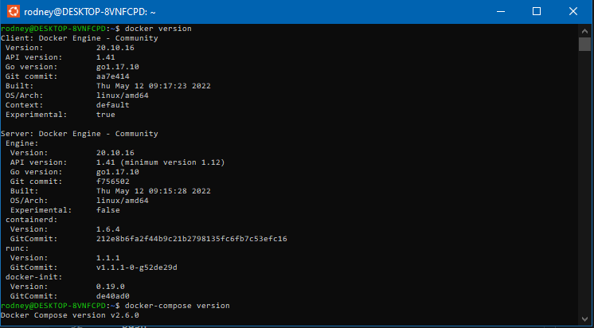

# 📄 Docker nativo no WSL2

Docker Nativo que roda no ambiente linux totalmente suportado pela WSL2.

> Veja este [tutorial](./wsl2-ubuntu.md) para saber como utilizar uma distribuição linux no WSL.

### Vantagens
- Consumo mínimo de memória para rodar Docker Daemon (Servidor Docker)
- É mais rápido do que Docker Desktop, porque roda diretamente na instância do WSL2, desta forma não fica separada da instância do Linux.

### Desvantagens
- Necessário executar o comando `sudo service docker start` sempre que o WSL2 for reiniciado, existe uma maneira para resolver.

## 🛠 Instalação

A instalação do Docker no WSL2 é idêntica a instalação do Docker na distribuição Linux, neste [link](https://docs.docker.com/engine/install/) possui a documentação oficial do Docker para instalação.

**Nesse tutorial iremos utilizar a distribuição Ubuntu.**

> Se tiver migrando do Docker Desktop para Docker Engine, desinstale do Windows o Docker Desktop, e no Ubuntu execute o comando abaixo para desinstala.
> ```bash
> sudo apt remove docker docker-engine docker.io containerd runc
> ```

Com o comando abaixo iremos atualizar o sistema e instalar os pré-requisitos.

```bash
sudo apt update && sudo apt upgrade
sudo apt-get install \
    apt-transport-https \
    ca-certificates \
    curl \
    gnupg \
    lsb-release
```

Adicione o repositório do Docker na lista de sources do Ubuntu.
```bash
curl -fsSL https://download.docker.com/linux/ubuntu/gpg | sudo gpg --dearmor -o /usr/share/keyrings/docker-archive-keyring.gpg
echo \
  "deb [arch=amd64 signed-by=/usr/share/keyrings/docker-archive-keyring.gpg] https://download.docker.com/linux/ubuntu \
  $(lsb_release -cs) stable" | sudo tee /etc/apt/sources.list.d/docker.list > /dev/null
```

Instalando o Docker Engine
```bash
sudo apt-get update
sudo apt-get install docker-ce docker-ce-cli containerd.io
```

Instalando o Docker Compose.

```bash
sudo curl -L "https://github.com/docker/compose/releases/latest/download/docker-compose-$(uname -s)-$(uname -m)" -o /usr/local/bin/docker-compose
sudo chmod +x /usr/local/bin/docker-compose
sudo ln -s /usr/local/bin/docker-compose /usr/bin/docker-compose
```

Dê permissão ao Docker com seu usuário.
```bash
sudo usermod -aG docker $USER
```

>Modifique sudousers para que o Dockerd que é usado para iniciar o daemon do Docker não necessite de senha.
> ```bash
> sudo visudo
> ```
> No final do arquivo adicione a seguinte linha, modifique colocando o nome do seu usuário 
> ```bash
> seu_usuário_aqui ALL=(ALL) NOPASSWD: /usr/bin/dockerd
> ```

Iniciando o serviço do Docker.
```bash
sudo service docker start
```

Agora execute os seguinte comandos abaixo para ver se esta tudo certo.

```bash
docker version
docker-compose version
```



Para executar o Daemon do Docker automaticamente ao iniciar realize instruções abaixo.

<details>
<summary><b>Windows 10</b></summary>

### No terminal do Linux
```bash
echo '# Inicia o daemon do Docker automaticamente ao efetuar login se não estiver em execução.' >> ~/.bashrc 
echo 'RUNNING=`ps aux | grep dockerd | grep -v grep`' >> ~/.bashrc
echo 'if [ -z "$RUNNING" ]; then' >> ~/.bashrc
echo '    sudo dockerd > /dev/null 2>&1 &' >> ~/.bashrc
echo '    disown' >> ~/.bashrc
echo 'fi' >> ~/.bashrc
```
</details>

<details>
<summary><b>Windows 11</b></summary>

### No terminal do Linux
```bash
sudo nano /etc/wsl.conf
```

Agora cole esse conteúdo
<pre>
[boot]
command="service docker start" 
</pre>

<blockquote>Para salvar pressione <code>CTRL + X</code>, depois <code>Y + ENTER</code></blockquote>

</details>

<br />

---

Para testar você pode execute o comando no terminal do Ubuntu.
```bash
docker run hello-world
```


<br />

## 🦸 Autor

<table align="left">
  <tr>
    <td align="center">
      <a href="#">
        <br>
        <sub>
          <b>Rodney Sostras</b>
        </sub>
      </a>
    </td>
  </tr>
</table>
<p>
    &nbsp;&nbsp;
    <a href="https://github.com/rodneysostras">
        
    </a>
</p>
<p>
    &nbsp;&nbsp;
    <a href="https://linkedin.com/in/rodney-sostras" alt="Linkedin do Rodney Sostras">
        
    </a>
</p>
<p>&nbsp;&nbsp;
    <a href="mailto:rodney.sostras@gmail.com" alt="Email do Rodney Sostras">
        
    </a>
</p>
<p>&nbsp;&nbsp;
    <a href="https://rodneysostras.me/" alt="Web Site do Rodney Sostras">
        
    </a>
</p>

<br />


## 📝 Licença

Este projeto esta sobe a licença [MIT](https://raw.githubusercontent.com/git/git-scm.com/main/MIT-LICENSE.txt).

Feito com ❤️ por Rodney Sostras 👋🏽 [Entre em contato!](https://www.linkedin.com/in/rodney-sostras/)

<br />

<div align="right"><a href="#">Voltar ao topo ⬆</a></div>