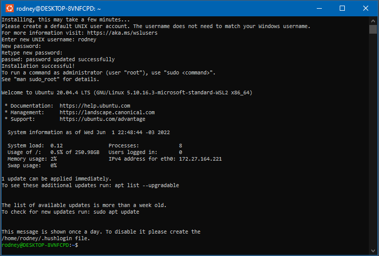

# 📄 habilitar o WSL2

WSL2 significa `Windows Subsystem for Linux version 2` isso e uma arquitetura do Windows que capacita o `Subsistema do Windows para Linux` para executar binários do Linux no Windows.

Neste [link](https://docs.microsoft.com/pt-br/windows/wsl/install-manual) possuí as instrução propria da Microsoft, mas abaixo tem o passo a passo de maneira resumida.

Para habilitar este recurso execute os seguintes commandos no `PowerShell` em **Modo administrador**.

```powershell
dism.exe /online /enable-feature /featurename:Microsoft-Windows-Subsystem-Linux /all /norestart
dism.exe /online /enable-feature /featurename:VirtualMachinePlatform /all /norestart
```

> No PowerShell digita o comando `wsl`, se não funcionar reinicie sua máquina.

Iremos utilizar a versão 2, no momento e a mais atual e com melhor performance, para isso atribua como default a versão 2 com o seguinte comando no `PowerShell` em **Modo Administrador**.

```powershell
wsl --set-default-version 2
```

## Instalando Linux no WSL

Na loja de aplicativos do Windows (Microsoft Store) pesquisando por `Linux` ira mostrar algumas distribuições para instalação.


Nesse caso iremos instalar o Ubuntu, apôs a instalação, você pode abrir terminal do Ubuntu pela loja ou no menu iniciar pesquisando por `Ubuntu`.

> Na primeira utilização do Ubuntu em seu terminal ira pedir o nome do usuário e senha, normalmente prefiro usar as mesma credenciais do meu usuário do windows para não esquecer.




> Para desinstalar basta executar o comando abaixo no `PowerShell` em **Modo Administrador**.
> ```powershell
> # wsl --unregister <distro name>
> wsl --unregister Ubuntu
> ```


> Caso queira fazer backup e so executar os comandos abaixo no `PowerShell` em **Modo Administrador**.
>> Exporta backup
>> ```powershell
>> # wsl --export <distro Name> <exporta para o local>
>> wsl --export Ubuntu c:\wsl_backup\ubuntu.tar
>> ```
> ---
>> Importa backup
>> ```powershell
>> # wsl --import <distro Name> <local para instalar> <backup>
>> wsl --import Ubuntu  c:\wsl\distro\ubuntu c:\wsl_backup\ubuntu.tar
>> ```

<br />

## 🦸 Autor

<table align="left">
  <tr>
    <td align="center">
      <a href="#">
        <br>
        <sub>
          <b>Rodney Sostras</b>
        </sub>
      </a>
    </td>
  </tr>
</table>
<p>
    &nbsp;&nbsp;
    <a href="https://github.com/rodneysostras">
        
    </a>
</p>
<p>
    &nbsp;&nbsp;
    <a href="https://linkedin.com/in/rodney-sostras" alt="Linkedin do Rodney Sostras">
        
    </a>
</p>
<p>&nbsp;&nbsp;
    <a href="mailto:rodney.sostras@gmail.com" alt="Email do Rodney Sostras">
        
    </a>
</p>
<p>&nbsp;&nbsp;
    <a href="https://rodneysostras.me/" alt="Web Site do Rodney Sostras">
        
    </a>
</p>

<br />


## 📝 Licença

Este projeto esta sobe a licença [MIT](https://raw.githubusercontent.com/git/git-scm.com/main/MIT-LICENSE.txt).

Feito com ❤️ por Rodney Sostras 👋🏽 [Entre em contato!](https://www.linkedin.com/in/rodney-sostras/)

<br />

<div align="right"><a href="#">Voltar ao topo ⬆</a></div>