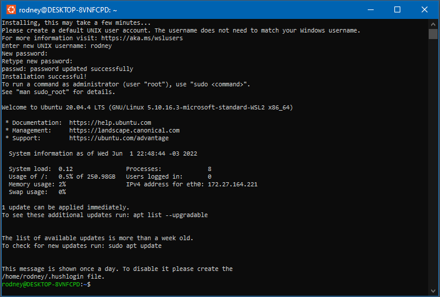

# 📄 Dotfile WSL2

WSL2 significa `Windows Subsystem for Linux version 2` isso e uma arquitetura do Windows que capacita o `Subsistema do Windows para Linux` para executar binários do Linux no Windows.

Nesta pasta possui o arquivo [.wslconfig](./.wslconfig) ele e responsável pela configuração WSL como a quantidade de memoria ram e processador que será usado.

Copie o arquivo [.wslconfig](./.wslconfig) e cole nesse local `C:\users\<seu usuário aqui>\.wslconfig`

> Para encontrar o local mais fácil execute esse comando no `Prompt(CMD)` ou `PowerShell` ira abrir explorer exatamente no local. 
> ```cmd
> explorer %UserProfile%
> ```

De um restart no WSL para carregar as configurações executando o comando abaixo no `PowerShell` no **Modo Administrador**.
> ```powershell
> Get-Service LxssManager | Restart-Service
> ```

## 🛠 Para habilitar o WSL

Neste [link](https://docs.microsoft.com/pt-br/windows/wsl/install-manual) possuí as instrução propria da Microsoft, mas abaixo irei dizer o passo a passo de maneira resumida.

Para habilitar este recurso execute os seguintes commandos no `PowerShell` em **Modo administrador**.

```powershell
dism.exe /online /enable-feature /featurename:Microsoft-Windows-Subsystem-Linux /all /norestart
dism.exe /online /enable-feature /featurename:VirtualMachinePlatform /all /norestart
```

> No PowerShell digita o comando `wsl`, se não funcionar reinicie sua máquina.

Iremos utilizar a versão 2, no momento e a mais atual e com melhor performance, para isso atribua como default a versão 2 com o seguinte comando no `PowerShell` em **Modo Administrador**.

```powershell
wsl --set-default-version 2
```

## Instalando Linux no WSL

Na loja de aplicativos do Windows (Microsoft Store) pesquisando por `Linux` ira mostrar algumas distribuições para instalação.


Nesse caso iremos instalar o Ubuntu, apôs a instalação, você pode abrir terminal do Ubuntu pela loja ou no menu iniciar pesquisando por `Ubuntu`.

> Na primeira utilização do Ubuntu em seu terminal ira pedir o nome do usuário e senha, normalmente prefiro botar as mesma credenciais do meu usuário no windows para não esquecer.




> Para desinstalar basta executar o comando abaixo no `PowerShell` em **Modo Administrador**.
> ```powershell
> # wsl --unregister <distro name>
> wsl --unregister Ubuntu
> ```


> Caso queira fazer backup e so executar os comandos abaixo no `PowerShell` em **Modo Administrador**.
>> Exporta backup
>> ```powershell
>> # wsl --export <distro Name> <exporta para o local>
>> wsl --export Ubuntu c:\wsl_backup\ubuntu.tar
>> ```
> ---
>> Importa backup
>> ```powershell
>> # wsl --import <distro Name> <local para instalar> <backup>
>> wsl --import Ubuntu  c:\wsl\distro\ubuntu c:\wsl_backup\ubuntu.tar
>> ```
